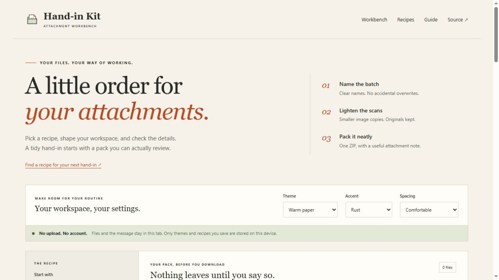
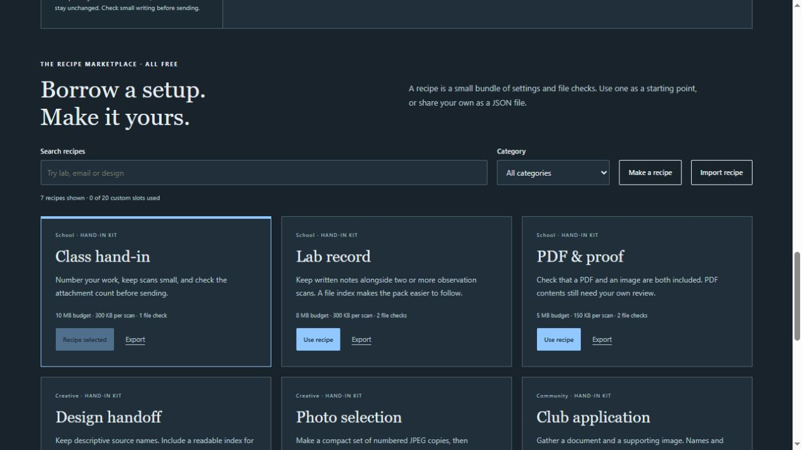
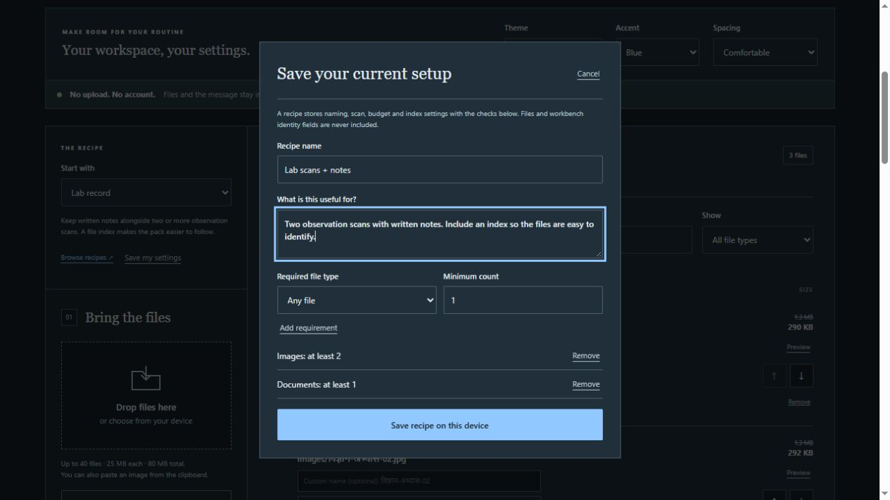
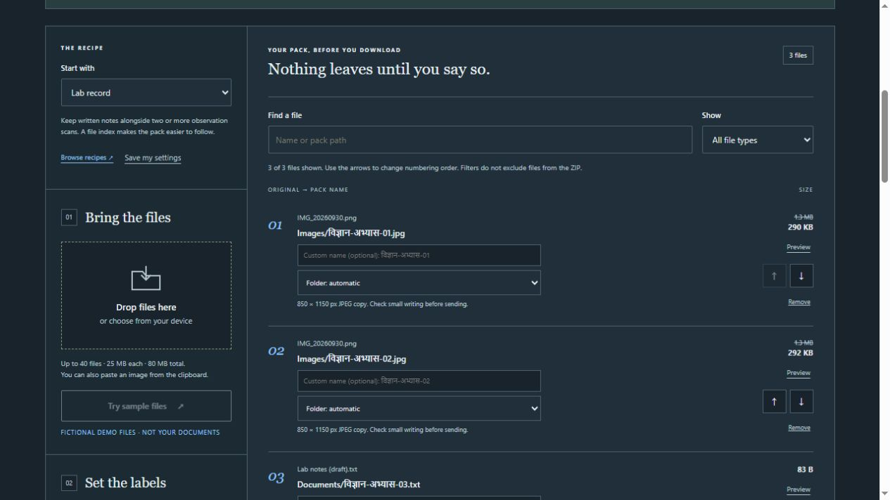
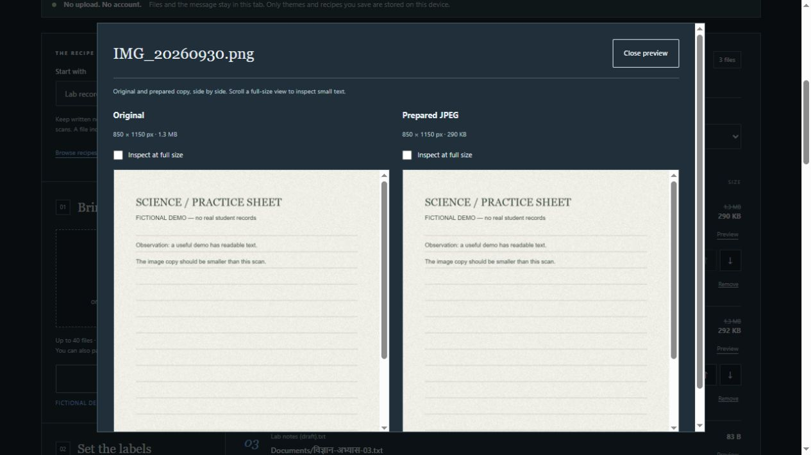

# Hand-in Kit

A small browser tool for the attachments you are about to send.

A folder of scans can be awkward to hand in: repeated camera filenames, pages in the wrong order, and images that are much larger than necessary. Hand-in Kit gives you a place to sort that out. Add the files, check their new names, make lighter copies of the scans, and download one organised ZIP.

[Try it here](https://aaravkatiyar55-gif.github.io/handin-kit/) · [Development notes](https://stardance.hackclub.com/projects/66961/devlogs/63161)



No sign-up or API key is needed. File processing happens in your browser, and the files on your device stay unchanged.

## Try a pack in a minute

Click **Try sample files** to start with two fictional scans and a notes file. They are made on your device; there are no real student records in the demo.

1. Choose **Lab record** from **Start with**. It asks for two images and a document, sets an 8 MB ZIP budget, and includes a CSV index.
2. Enter a subject. For example, `विज्ञान अभ्यास` produces names such as `Images/विज्ञान-अभ्यास-01.jpg` after image conversion. You can also change each name yourself.
3. Click **Make smaller image copies**, then open **Preview**. Compare the copy with the original and inspect the writing at full size.
4. Check the file order, checklist and ZIP size. Download the pack, open it, and review the attachments before sending.
5. Adjust the suggested message if you want. It keeps your wording while you change the pack; **Reset suggestion** generates a new suggestion.

For your own work, use the file picker, drag files onto the workbench, or paste an image while you are outside a text field. Nothing is sent automatically.

## What changed in version 2

The first version covered naming, smaller scan copies and ZIP packing. The workspace update makes those steps easier to repeat and gives you more control over what goes into the pack.

| Addition | How it helps |
| --- | --- |
| Recipe marketplace | Browse seven free starting setups, or narrow them by search and category. |
| Custom recipes | Save up to 20 setups with a name, description and file checklist. Edit them when your routine changes. |
| Recipe import and export | Move a setup to another browser as a small JSON file. It contains settings, not your attachments or the workbench's name fields. |
| Appearance controls | Choose warm paper, mint desk or night ink, with three accent colours and two spacing options. |
| Exact duplicate check | Find files with identical original bytes. Remove the extra copies from the pack and undo the removal if needed. |
| Attachment preview | Compare an original scan and its JPEG copy side by side. Text files have a size-limited preview too. |
| File ordering | Move files up or down so numbered names follow the order you want. Original-name sorting is also available. |
| Folder choices | Put an individual file in Work, References, Extras, a type folder, or the ZIP's root. |
| ZIP budget | See the archive size, including the note and optional index, before downloading. Going over budget shows a warning. |
| File checklist | See whether the pack contains the types and counts your chosen recipe asks for. |
| Editable message | Keep your own hand-in wording while renaming or rearranging files. Copy it when you are ready. |
| Pack report | Download a JSON list of filenames, destinations, sizes and checklist results. |

A **recipe** is just a reusable set of settings and file checks. The marketplace is a local catalogue of examples; it has no payments, public uploads or community sellers. You can start with a built-in recipe and save an adjusted copy.

File search and type filters only change what you see in the list. Hidden rows still go into the ZIP. Duplicate detection compares bytes, so two similar-looking photos are not necessarily duplicates.

## A closer look

These screenshots are from the public app. The scans shown are fictional demo files.

### Recipes and reusable settings





### Review the pack before sending





## A few limits to keep in mind

**Check the writing after conversion.** JPEG, PNG and WebP images can become smaller JPEG copies. Transparent areas become white, and image metadata is not carried through the canvas. Size targets are best effort. Very large images above 24 megapixels and images that fail conversion are kept unchanged.

**PDFs are kept as they are.** PDFs, GIFs, HEIC images and other files can go into the pack, but this tool does not compress them. The ZIP uses the stored format, so it adds a little overhead rather than reducing those files.

**The checklist checks types and counts.** It cannot tell whether a document is complete, a scan is readable, or a recipient will accept it. A PDF check uses the filename extension, not the contents.

**The pack has limits.** You can add up to 40 files, with a maximum of 25 MiB per file and 80 MiB in total. An oversized selection is rejected as a whole. Recipe imports are limited to 32 KB and supported settings; unknown properties are discarded.

**Names are cleaned before packing.** Hindi text is preserved, unsafe filename characters are replaced, and repeated paths get a suffix. The optional CSV index also protects against filenames being interpreted as spreadsheet formulas.

## What stays on your device

Attachments, subject/name fields and your message stay in this tab. Reloading clears that working pack. A downloaded ZIP stays on your device, and the original files are never renamed or replaced.

Appearance and recipes you explicitly save are stored in this browser. Open **What is saved on this device?** to clear this app's saved preferences. That leaves the current attachments and other sites' data alone.

The first visit downloads the app's public files from GitHub Pages. The app can then cache its code for offline use; it does not cache your chosen attachments. There is no analytics service or remote file processing. A pack report includes original filenames, so check it before sharing it.

## Run the source locally

You need Node.js 22 or newer. There are no runtime packages, accounts or keys to configure.

```sh
git clone https://github.com/aaravkatiyar55-gif/handin-kit.git
cd handin-kit
npm start
```

Open `http://127.0.0.1:4190`. If you prefer running the script directly, use `node scripts/serve.mjs`.

To check the source and try the production build:

```sh
npm test
npm run check
npm run build
node scripts/serve.mjs --dist --port 4191
```

Open `http://127.0.0.1:4191` for the built app. The source server on port 4190 skips the offline cache so saved code changes stay visible. Use the build server or HTTPS deployment when checking offline behaviour.

The latest validation covers 21 automated tests, 13 JavaScript syntax checks and the eleven-file public build. Browser checks covered recipes, duplicate removal/undo, Hindi names, previews, downloads, mobile/tablet layouts and offline reloads. Full observations and remaining gaps are in [TESTING.md](TESTING.md).

Python 3 is optional if you want a separate ZIP reader check:

```sh
node scripts/zip-fixture.mjs
python test/read_zip.py
```

## Where to make changes

The app uses HTML, CSS and JavaScript modules without a framework or backend.

| File | Start here for |
| --- | --- |
| `index.html` and `styles.css` | Page layout, labels, themes and responsive styling |
| `src/app.js` | Picker, pack state, recipe controls, previews and downloads |
| `src/core.js` | File limits, naming, attachment notes and CSV index |
| `src/images.js` | Image-header checks, conversion and fictional demo files |
| `src/recipes.js` | Built-in recipes, import validation and file-count checks |
| `src/workbench.js` | ZIP-size estimates, duplicates, folders and report data |
| `src/zip.js` | ZIP writing, UTF-8 filenames, CRC checks and cancellation |
| `sw.js` | Offline app cache |
| `test/` | Automated edge cases and the optional Python ZIP reader |

## Publishing it

GitHub Pages uses `.github/workflows/pages.yml`. Pushes to `main` run checks, tests and the build before deploying. Set the repository's Pages source to **GitHub Actions**. Pull requests run checks without publishing.

The build copies only eleven public app files into `dist/` and gives the offline cache a content-based version. Documentation screenshots are kept in the repository and are not included in the app bundle. Relative URLs let the app work under a path such as `/handin-kit/`. Another static host can serve `dist/` over HTTPS too.

## Assistance and project status

Aarav requested the project and chose its direction and features. Codex wrote the implementation, design, tests and documentation, and performed the recorded browser checks. This is substantially AI-assisted work; no human-only coding claim is made.

The project is entered in Stardance's [Frictionless mission](https://stardance.hackclub.com/missions/frictionless). A working demo, a devlog and tracked time do not by themselves establish reviewer approval. The exact platform observations and outstanding requirements are recorded in [TESTING.md](TESTING.md).

MIT licensed. You can keep using, changing and hosting this source without a ChatGPT subscription.
